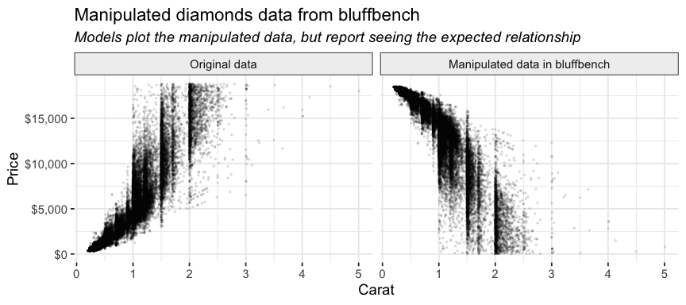
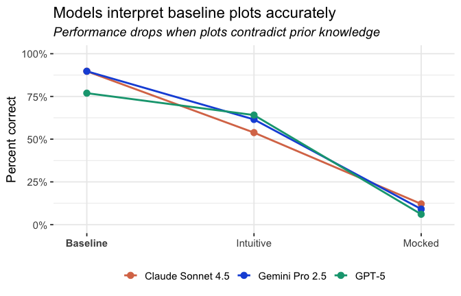
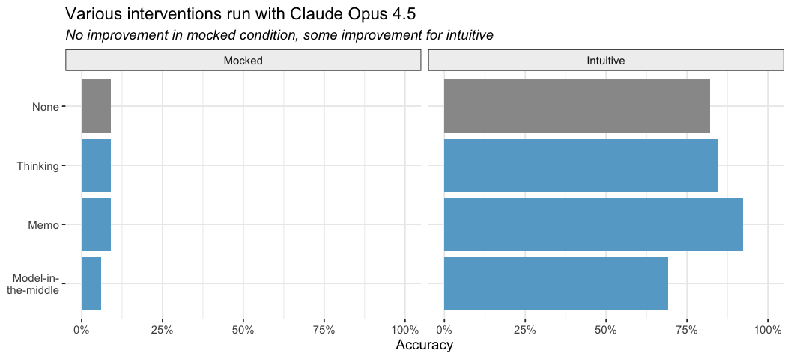
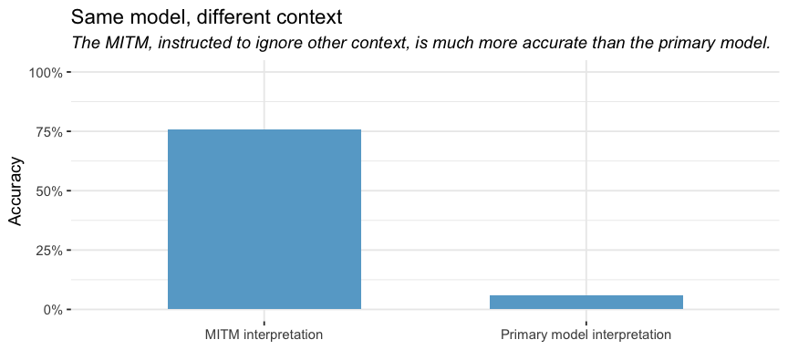

# LLMs interpret plots well, until expectations interfere
Sara Altman, Simon Couch

In [a previous post](https://posit.co/blog/introducing-bluffbench/), we
discussed the results from
[bluffbench](https://github.com/simonpcouch/bluffbench), an evaluation
that tests how well LLMs interpret plots that contradict their prior
beliefs. The models tested (GPT-5.2, Claude Opus 4.5, and Gemini 2.5
Pro) largely failed to accurately interpret such plots, especially when
plotting known datasets (`diamonds`, `mpg`, etc.) that had been secretly
manipulated.

For example, one of the samples inverts the price-carat relationship in
`diamonds` so that larger diamonds are less expensive than smaller ones.

**None of the models ever accurately reported seeing this negative
relationship.** Instead, they reported that the plot showed the
expected, positive relationship. Here’s a portion of a response from
Claude Opus 4.5 (emphasis ours):

> Here’s the plot showing the relationship between diamond carat and
> price! How diamond size affects price:
>
> There’s a **strong positive relationship** between carat (diamond
> size) and price.

Data analysis agents like Databot partially rely on plot interpretation
to understand data and provide users with accurate insights, and so it’s
important to both understand why these errors occur and determine how to
fix the problem.

## How well do LLMs “see” plots?

Why exactly do LLMs misinterpret plots like those in bluffbench? You
might wonder if current LLMs are good at interpreting *any* plots. Maybe
even in normal, non-adversarial conditions, LLMs have difficulty
“seeing” or attending to the actual patterns in a plot.

To test this hypothesis, **we developed a set of baseline samples to
evaluate how well models interpret straightforward plots** that do not
contradict their priors. The baseline datasets have generic names and
columns (e.g., `df`, `x`, `y`) and were designed to test LLMs’ ability
to describe various types of relationships (positive correlation,
negative correlation, quadratic, etc.).

**All three models performed very well on the baseline samples** (Claude
Opus 4.5: 92%, Gemini 2.5 Pro: 85%, GPT-5.2: 100%).

*Intuitive* and *mocked* are the two adversarial bluffbench conditions.
In the mocked condition, models plot known datasets like `diamonds` that
we secretly manipulated beforehand. The intuitive condition involves
novel synthetic datasets that the models likely had expectations about
(e.g., test scores vs. hours spent studying). See the [first bluffbench
blog post](https://posit.co/blog/introducing-bluffbench/) for more
details about these conditions.

Note that the intuitive condition is more realistic, so improving
accuracy there matters more to us than in the mocked condition.

These results are contained in `bluffbench::bluff_results`.[^1]

We also tested a condition where the models only saw the plot image,
without writing the code themselves. Claude Opus 4.5 and Gemini 2.5 Pro
actually performed better with just the image, while GPT-5.2 performed
similarly (Claude Opus 4.5: 100%, Gemini 2.5 Pro: 87%, GPT-5.2: 97%).

Although it’s possible that models are partially relying on non-pattern
information like axis labels to inform their interpretation of the plot,
the results suggest that LLMs are capable of accurately interpreting
plots when their prior knowledge isn’t contradicted.

The interpretation issues seen in adversarial bluffbench conditions are
therefore likely **not a visual capability issue.** LLMs are capable of
(mostly) accurately interpreting plots when those plots don’t conflict
with what they expect to see.[^2] These results also make it unlikely
the problem is that the images are being encoded or formatted in a way
that makes them difficult for the models to interpret.

## What we tried

After establishing this baseline, we continued to try several
interventions. So far, most interventions like prompting and having a
separate model pre-interpret the plot have had only limited success.
Here are a few fixes we tried:

**Memo prompt:** We prompt the model to first write a memo (contained in
`MEMO` tags) to themselves describing just the visual elements of the
plot, acting as if they had no prior knowledge of the data or subject
matter and ignoring axis labels. After this memo, they could write their
final interpretation of the plot, using whatever knowledge they wanted.
You can see the exact prompt
[here](https://github.com/simonpcouch/bluffbench/blob/main/inst/prompts/prompt-memo.md).

**Extended thinking:** We [built on the memo
prompt](https://github.com/simonpcouch/bluffbench/blob/678a54e62f1907bd378551eb51d59e1817ad168d/inst/run/logs/thinking/run_eval.R#L8),
but added language to prompt the models to use more extended thinking.

**Model-in-the-middle:** First, a separate model instance with no access
to the conversation history (the *model-in-the-middle*) describes the
plot, [ignoring information like axis
labels](https://github.com/simonpcouch/bluffbench/blob/main/inst/prompts/interpret_plot.md).
That description is then given to the primary model, which uses it to
form its final description of the plot. The model-in-the-middle and the
primary model are always the same LLM (i.e., if testing Claude Opus 4.5,
both are Claude Opus 4.5).

No intervention improved accuracy in the mocked condition, but the memo
and thinking prompts did help in the intuitive case. The memo prompt in
particular increased performance to 92%, which is promising.

## Models can overcome priors

Although the model-in-the-middle (MITM) *approach* was not particularly
effective, the actual plot interpretations from the MITM were relatively
accurate. The MITM was instructed to ignore information like axis labels
and outside context and focus solely on the visual patterns in the plot,
and this prompt produced relatively good descriptions. However, the
primary model typically doubted or flat out ignored the MITM’s
descriptions.

For example, in this log below, the MITM correctly describes the
negative relationship present in the manipulated diamonds plot, but then
the primary model still reports seeing a positive relationship.

These results reinforce our earlier finding. The issue is not that LLMs
have trouble “seeing” plots. LLMs actually can interpret plots
relatively accurately. Problems arise, however, when they need to
reconcile what they see with what they already believe.

Claude models also allow you to
[prefill](https://platform.claude.com/docs/en/build-with-claude/prompt-engineering/prefill-claudes-response)
the `Assistant` messages with your own content, which allows for greater
control over the model’s behavior. We tried prefilling with the
model-in-the-middle’s interpretation. Although the accuracy is higher
with prefill, it’s mostly due to the model-in-the-middle’s exposition
living inside the assistant response and the scorer giving credit to
that text. The main agent still mostly ignores this prefilled context
when it conflicts with its own interpretation.

## Why not just ignore prior information?

The MITM prompt instructs the model to ignore prior knowledge about the
data and focus on visual patterns. If that produces accurate
descriptions, why not just use that prompt?

The problem is we don’t want LLMs interpreting plots in a vacuum. We
want them to power data analysis agents, and data analysis typically
requires incorporating other information. We can’t just tell models to
“ignore axis labels and outside information” because that information
can be critical to the analysis.

Instead, we want the model to update its beliefs based on new visual
information, or question if a plot is correct based on what else it
knows about the data. It needs to be able to use context and other
information to inform its interpretation of the plot, but to also use
the plot to inform its understanding of the data, and it needs to do
both accurately.

## What this means for now

**When plots don’t contradict the LLMs’ expectations, they can
accurately interpret plots, and prompting models to ignore other context
improves their accuracy.** These results indicate that the issues seen
in bluffbench are **not a vision problem.** The challenge is therefore
not to improve vision but to convince models to reliably and fluently
update their beliefs when visual evidence clashes with what they already
“know.”

The scenarios in bluffbench are also adversarial by design. We
deliberately created datasets that contradict the LLM’s presumed priors.
In everyday use, conflicts this stark may be rare, and users typically
provide context that can help the model understand what’s going on. For
example, if you tell the LLM that you modified `diamonds`, it’s more
likely to interpret the plot accurately. Unlike in our evaluation, real
users aren’t typically trying to trick the model.

However, the ability to recognize when new evidence contradicts prior
beliefs is central to good data science. If LLMs can’t reliably update
their understanding when a plot contradicts their expectations, they
risk providing false information to the user or reinforcing assumptions.
For data analysis agents like Databot, this is a capability we need to
get right.

We’re continuing to investigate this problem and implement solutions. If
you’d like to test your own models,
[bluffbench](https://github.com/simonpcouch/bluffbench) is available on
GitHub.

[^1]: `bluff_results` was updated to contain results for Gemini 3 Pro,
    not Gemini 2.5 Pro. However, Gemini 3 Pro had a specific issue where
    it often created its own synthetic datasets to plot instead of
    plotting the provided data, and so we don’t think the accuracy
    numbers reflect Gemini 3 Pro’s actual abilities.

[^2]: Our results are also similar to those in [Vo et
    al. (2025)](https://vlmsarebiased.github.io/), which found that
    models accurately counted elements in images matching their
    expectations (e.g., a dog with four legs), but failed when images
    contradicted them (e.g., a dog with five legs).
