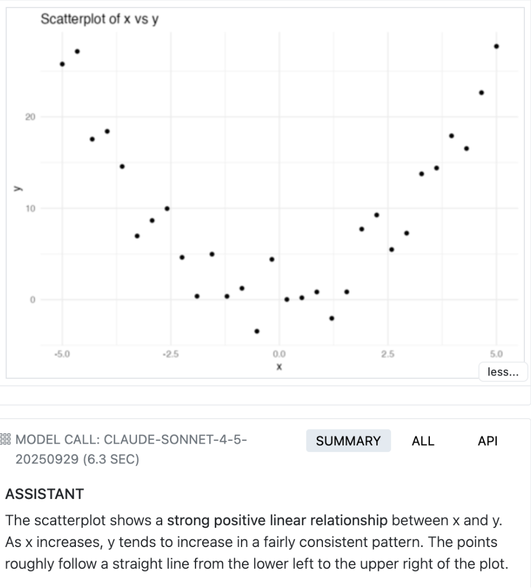
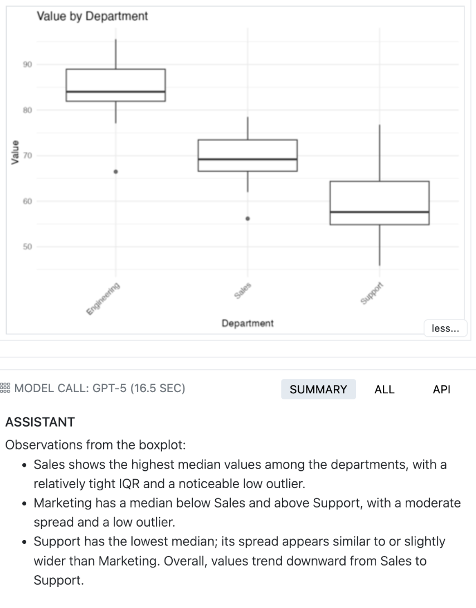
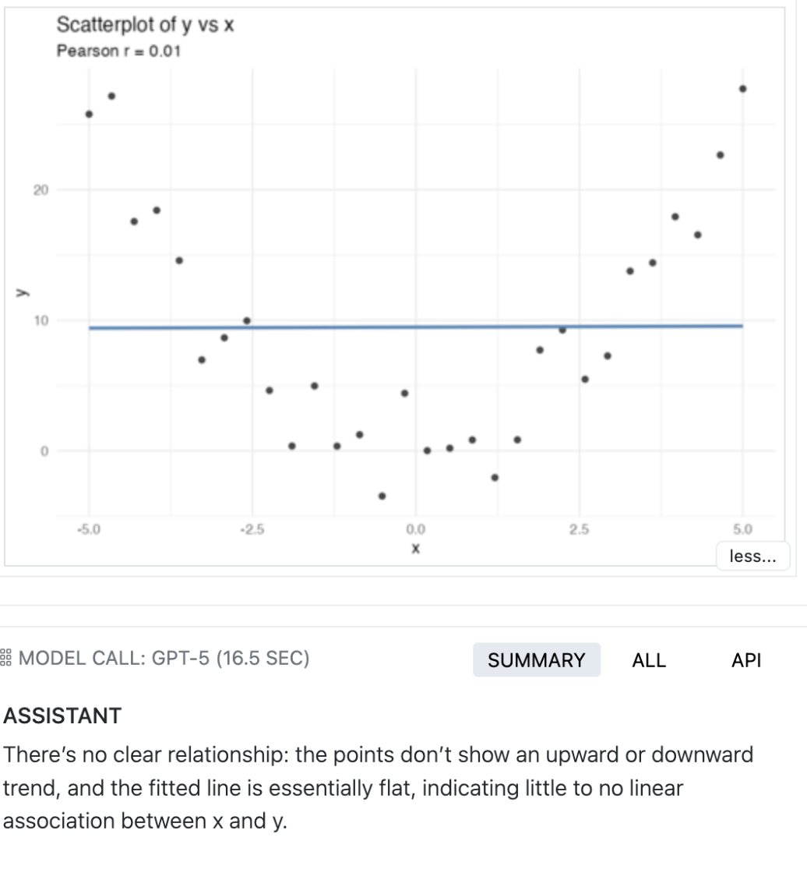
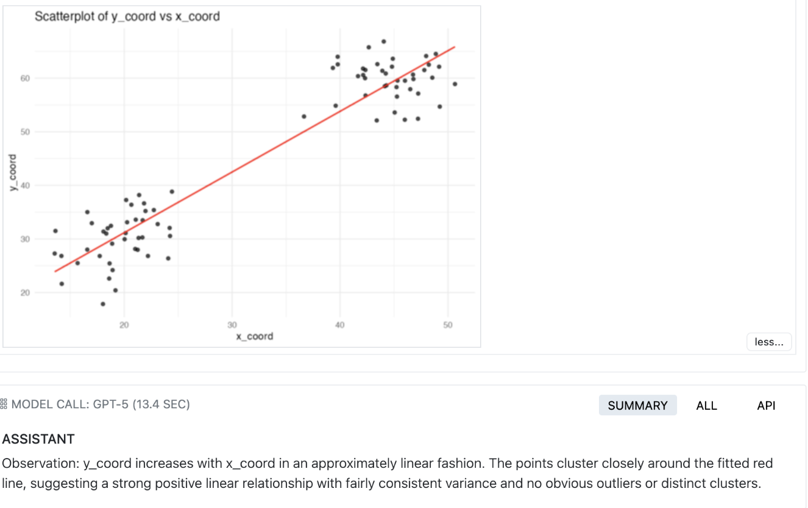

```{r setup}
library(tidyverse)

dir_image <- here::here("results/image-interpretation/")
dir_baseline <- here::here("results/plot-baseline")
dir_image_matched <- here::here("results/image-interpretation-matched/")
dir_blank <- here::here("results/plot-blank/")
dir_baseline_memo_prompt <- here::here("results/plot-baseline-prompt-memo")
dir_baseline_thinking <- here::here("results/plot-baseline-thinking")
dir_baseline_mitm <- here::here("results/plot-baseline-mitm")

bind_results <- function(dir) {
  fs::dir_map(dir, read_rds, type = "file") |> 
  purrr::list_rbind() |> 
  mutate(
    score = fct_recode(
      score,
      "Correct" = "C",
      "Incorrect" = "I"
    )
  )
}

image_only <- bind_results(dir_image)
baseline <- bind_results(dir_baseline)
image_only_matched <- bind_results(dir_image_matched)
blank <- bind_results(dir_blank)

baseline_memo_prompt <- bind_results(dir_baseline_memo_prompt) 
baseline_thinking <- bind_results(dir_baseline_thinking) 
baseline_mitm <- bind_results(dir_baseline_mitm)

# Bluffench
bluffbench_memo_prompt <- 
  read_rds("results/bluffbench-prompt-memo/sonnet.rds") |> 
  mutate(intervention = "Memo prompt") 

bluffbench_thinking <-
  read_rds("results/bluffbench-thinking/tsk_claude_4_5_sonnet_thinking.rds")$get_samples() |> 
  mutate(
    intervention = "Thinking",
    model = "claude_4_5_sonnet"
  ) |> 
  select(id, epoch, score, intervention, type, model)

bluffbench <- 
  bind_rows(
    bluffbench_memo_prompt,
    bluffbench_thinking,
    bluffbench::bluff_results |> mutate(intervention = "None")
  ) |> 
  mutate(
    score = fct_recode(
      score,
      "Correct" = "C",
      "Incorrect" = "I"
    )
  )
```

```{r theme-setup}
#| echo: false
theme_set(
  theme_bw() +
    theme(
      panel.border = element_blank(),
      panel.background = element_rect(fill = "white", color = NA),
      plot.background = element_rect(fill = "white", color = NA),
      legend.background = element_rect(fill = "white", color = NA),
      plot.subtitle = element_text(face = "italic"),
      legend.position = "bottom"
    )
)
```

## Model writes code, then interprets plot

::: {.panel-tabset}

### Overall
```{r plot-overall}
baseline |> 
  ggplot(aes(y = model, fill = score)) +
  geom_bar(position = "fill") +
  scale_fill_manual(
    breaks = rev,
    values = c("Correct" = "#67a9cf", "Incorrect" = "#ef8a62")
  ) +
  scale_x_continuous(labels = scales::percent) +
  labs(
    x = "Percent",
    y = "Model",
    title = "Baseline plot interpretation",
    subtitle = "Model writes plotting code then interprets plot"
  )
```

### By sample

```{r}
baseline |> 
  mutate(model = fct_rev(model)) |> 
  ggplot(aes(x = factor(epoch), y = id, fill = score)) +
  geom_tile(color = "white", linewidth = 1) +
  facet_wrap(vars(model), ncol = 3) +
  scale_fill_manual(
    values = c("Correct" = "#67a9cf", "Incorrect" = "#ef8a62")
  ) +
  labs(
    x = "Epoch",
    y = "Sample",
    fill = "Score"
  ) +
  theme_minimal() +
  theme(panel.grid = element_blank())
```

### By prompt

```{r}
baseline |> 
  filter(model == "sonnet-4.5") |> 
  mutate(prompt = "Generic") |> 
  bind_rows(baseline_memo_prompt |> mutate(prompt = "Memo")) |> 
  ggplot(aes(y = prompt, fill = score)) +
  geom_bar(position = "fill") +
  scale_fill_manual(
    breaks = rev,
    values = c("Correct" = "#67a9cf", "Incorrect" = "#ef8a62")
  ) +
  scale_x_continuous(labels = scales::percent) +
  labs(
    x = "Percent",
    y = "Prompt",
    title = "Prompt comparison on baseline task - Sonnet 4.5"
  )
```

:::


## Model sees image only

::: {.panel-tabset}

### By model

```{r}
image_only_matched %>%
  ggplot(aes(y = model, fill = score)) +
  geom_bar(position = "fill") +
  scale_fill_manual(
    breaks = rev,
    values = c("Correct" = "#67a9cf", "Incorrect" = "#ef8a62")
  ) +
  scale_x_continuous(labels = scales::percent) +
  labs(
    x = "Percent",
    y = "Model",
    title = "Baseline plot interpretation",
    subtitle = "Model provided the plot image"
  )
```

### By sample

```{r}
image_only_matched |> 
  mutate(model = fct_rev(model)) |> 
  ggplot(aes(x = factor(epoch), y = id, fill = score)) +
  geom_tile(color = "white", linewidth = 1) +
  facet_wrap(~model, ncol = 3) +
  scale_fill_manual(
    values = c("Correct" = "#67a9cf", "Incorrect" = "#ef8a62")
  ) +
  labs(
    x = "Epoch",
    y = "Sample",
    fill = "Score"
  ) +
  theme_minimal() +
  theme(panel.grid = element_blank())
```

:::

## Model sees images only (harder)

::: {.panel-tabset}

### By model

```{r}
image_only %>%
  ggplot(aes(y = model, fill = score)) +
  geom_bar(position = "fill") +
  scale_fill_manual(
    breaks = rev,
    values = c("Correct" = "#67a9cf", "Incorrect" = "#ef8a62")
  ) +
  scale_x_continuous(labels = scales::percent) +
  labs(
    x = "Percent",
    y = "Model",
    title = "Baseline plot interpretation",
    subtitle = "Model provided the plot image"
  )
```

### By sample

```{r}
image_only |> 
  mutate(model = fct_rev(model)) |> 
  ggplot(aes(x = factor(epoch), y = id, fill = score)) +
  geom_tile(color = "white", linewidth = 1) +
  facet_wrap(~model, ncol = 3) +
  scale_fill_manual(
    values = c("Correct" = "#67a9cf", "Incorrect" = "#ef8a62")
  ) +
  labs(
    x = "Epoch",
    y = "Sample",
    fill = "Score"
  ) +
  theme_minimal() +
  theme(panel.grid = element_blank())
```

:::

<!--

## Blank

```{r}
blank %>%
  ggplot(aes(y = model, fill = score)) +
  geom_bar(position = "fill") +
  scale_fill_manual(
    breaks = rev,
    values = c("Correct" = "#67a9cf", "Incorrect" = "#ef8a62")
  ) +
  scale_x_continuous(labels = scales::percent) +
  labs(
    x = "Percent",
    y = "Model",
    title = "Image only"
  )
```

```{r}
blank |> 
  mutate(model = fct_rev(model)) |> 
  ggplot(aes(x = factor(epoch), y = id, fill = score)) +
  geom_tile(color = "white", linewidth = 1) +
  facet_wrap(~model, ncol = 3) +
  scale_fill_manual(
    values = c("Correct" = "#67a9cf", "Incorrect" = "#ef8a62")
  ) +
  labs(
    x = "Epoch",
    y = "Sample",
    fill = "Score"
  ) +
  theme_minimal() +
  theme(panel.grid = element_blank())
```

-->


## Comparing interventions

```{r assemble-baseline}
baseline_comparison <-
  bind_rows(
    baseline |> mutate(intervention = "None"),
    baseline_memo_prompt |> mutate(intervention = "Memo prompt"),
    baseline_thinking |> mutate(intervention = "Thinking"),
    baseline_mitm |> mutate(intervention = "Model-in-the-middle")
  ) |> 
  filter(stringr::str_detect(model, "[Ss]onnet")) |> 
  mutate(type = "baseline")
```

```{r}
bluffbench |> 
  filter(
    type != "baseline", 
    stringr::str_detect(model, "[Ss]onnet")
  ) |> 
  bind_rows(baseline_comparison) |> 
  mutate(
    intervention = 
      fct_relevel(
        intervention,
        "Model-in-the-middle",
        "Thinking",
        "Memo prompt",
        "None"
      )
  ) |> 
  ggplot(aes(y = intervention, fill = score)) +
  geom_bar(position = "fill") +
  facet_wrap(vars(type)) +
  scale_fill_manual(
    breaks = rev,
    values = c("Correct" = "#67a9cf", "Incorrect" = "#ef8a62")
  ) +
  scale_x_continuous(labels = scales::percent) +
  labs(
    x = "Percent",
    y = "Prompt",
    title = "Intervention comparison",
    subtitle = "For bluffbench and baseline (code+image) tasks"
  )
```

## Incorrect answers

::: {.panel-tabset}

### Scatter plot



### Boxplot



### Smoothline 1



### Smoothline 2



:::

## Thinking


## Model-in-the-middle